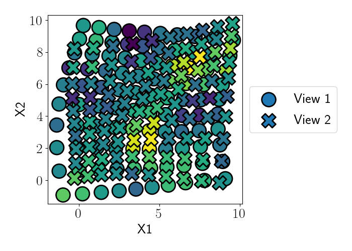

# Gaussian Process Spatial Alignment (GPSA)


---

The `gpsa` package implements Gaussian Process Spatial Alignment, a probabilistic model for aligning spatial genomics data into a shared coordinate system using deep Gaussian processes. This work is described in the paper:\
➤️ [Alignment of spatial genomics and histology data using deep Gaussian processes](https://www.biorxiv.org/content/10.1101/2022.01.10.475692v1).

📄 [Full Documentation](https://andrewcharlesjones.github.io/spatial-alignment/gpsa.html)

---

## 🚀 Installation

You can install `gpsa` directly from PyPI:

```bash
pip install gpsa
```

> Note: `gpsa` requires Python 3.10+ and is built on top of [PyTorch](https://pytorch.org/).

If you are testing a pre-release version on TestPyPI:

```bash
pip install --index-url https://test.pypi.org/simple/ --extra-index-url https://pypi.org/simple gpsa
```

---

## 🔬 Overview

The GPSA package provides two primary classes:

- `GPSA` — defines the core generative model for probabilistic spatial alignment.
- `VariationalGPSA` — extends `GPSA` with a variational approximation for scalable inference.

The package allows joint modeling of multiple spatial genomics datasets by correcting spatial misalignments across experiments or modalities.

---

## 🤪 Quick Example

We demonstrate GPSA on a small synthetic dataset (available in `examples/`).

```python
import numpy as np
import anndata

data = anndata.read_h5ad("./examples/synthetic_data.h5ad")

X = data.obsm["spatial"]
Y = data.X
view_idx = [np.where(data.obs.batch.values == ii)[0] for ii in range(2)]
n_samples_list = [len(x) for x in view_idx]

import torch

x = torch.from_numpy(X).float().clone()
y = torch.from_numpy(Y).float().clone()

data_dict = {
    "expression": {
        "spatial_coords": x,
        "outputs": y,
        "n_samples_list": n_samples_list,
    }
}
```

Now instantiate and train the model:

```python
from gpsa import VariationalGPSA
from gpsa import rbf_kernel

model = VariationalGPSA(
    data_dict,
    n_spatial_dims=2,
    m_X_per_view=50,
    m_G=50,
    data_init=True,
    n_latent_gps={"expression": None},
    mean_function="identity_fixed",
    kernel_func_warp=rbf_kernel,
    kernel_func_data=rbf_kernel,
    fixed_view_idx=0,
)

optimizer = torch.optim.Adam(model.parameters(), lr=1e-2)

def train(model, loss_fn, optimizer):
    model.train()
    G_means, G_samples, F_latent_samples, F_samples = model.forward(
        {"expression": x}, view_idx=view_idx, Ns=n_samples_list, S=5
    )
    loss = loss_fn(data_dict, F_samples)
    optimizer.zero_grad()
    loss.backward()
    optimizer.step()
    return loss.item()

for t in range(3000):
    loss = train(model, model.loss_fn, optimizer)
```

For full runnable example code, see:\
➤️ [`examples/grid_example.py`](examples/grid_example.py)

---

## 📊 Visualization

Example output showing the alignment of two misaligned spatial views:



The aligned coordinates converge during training:


---

## 🐞 Bug Reports

If you encounter any issues, please open an issue on the [GitHub repository](https://github.com/engelhardtgpsa/spatial-alignment/issues).

---

## 📔 Citation

If you use GPSA in your work, please cite:

> Jones, A. C., et al. Alignment of spatial genomics and histology data using deep Gaussian processes. bioRxiv (2022).

[DOI link](https://www.biorxiv.org/content/10.1101/2022.01.10.475692v1)

---

## 📜 License

MIT License

---

