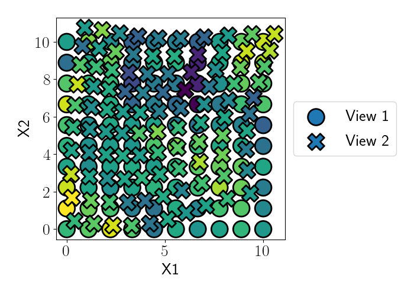

# Gaussian Process Spatial Alignment (GPSA)

---

The `gpsa` package implements Gaussian Process Spatial Alignment, a probabilistic model for aligning spatial genomics data into a shared coordinate system using deep Gaussian processes. This work is described in the paper:
➤️ [Alignment of spatial genomics and histology data using deep Gaussian processes](https://www.biorxiv.org/content/10.1101/2022.01.10.475692v1).

📄 [Full Documentation](https://andrewcharlesjones.github.io/spatial-alignment/gpsa.html)

---

## 🚀 Installation

You can install `gpsa` directly from PyPI:

```bash
pip install gpsa
```

> Note: `gpsa` requires Python 3.10+ and is built on top of [PyTorch](https://pytorch.org/).

If you are testing a pre-release version on TestPyPI:

```bash
pip install --index-url https://test.pypi.org/simple/ --extra-index-url https://pypi.org/simple gpsa
```

---

## 🔬 Overview

The GPSA package provides two primary classes:

* `GPSA` — defines the core generative model for probabilistic spatial alignment.
* `VariationalGPSA` — extends `GPSA` with a variational approximation for scalable inference.

The package allows joint modeling of multiple spatial genomics datasets by correcting spatial misalignments across experiments or modalities.

---

## 🧪 Quick Example

We demonstrate GPSA on a small synthetic dataset (available in `examples/`). See [`examples/grid_example.py`](examples/grid_example.py) for full runnable code.

---

## 🧪 Testing New Builds on TestPyPI

This section walks you through how to test your TestPyPI package builds using a clean virtual environment. This is especially helpful for validating your published package before releasing to PyPI.

### STEP 1: Create a Clean Python 3.8, 3.9, 3.10, or 3.11 Environment

Make sure you have Python 3.8, 3.9, 3.10, or 3.11 installed. Then create and activate a virtual environment:

```bash
python3.10 -m venv gpsa_test_env
source gpsa_test_env/bin/activate
```

### STEP 2: Install GPSA from TestPyPI

Install the GPSA package (adjust the version as needed) from TestPyPI, while allowing dependencies to come from PyPI:

```bash
pip install --extra-index-url https://test.pypi.org/simple/ gpsa==0.6.5 --timeout 180
```

Notes:

* Use `--extra-index-url` (not `--index-url`) so pip installs `gpsa` from TestPyPI, but dependencies from real PyPI.
* The `--timeout 180` flag allows for longer download times if needed.

### STEP 3: Clone the GitHub Repository

If you haven't already, clone the repository and navigate to the example folder:

```bash
git clone https://github.com/engelhardtgpsa/spatial-alignment.git
cd spatial-alignment/examples
```

### STEP 4: Run the Example Script

Run the example:

```bash
python grid_example.py
```

This will simulate synthetic data and run GPSA alignment. It should complete in a few minutes depending on your machine.

### CLEANUP

To deactivate the environment when you're done:

```bash
deactivate
```

---

## 📊 Visualization

Example output showing the alignment of two misaligned spatial views:



The aligned coordinates converge during training:


---

## 🐞 Bug Reports

If you encounter any issues, please open an issue on the [GitHub repository](https://github.com/engelhardtgpsa/spatial-alignment/issues).

---

## 📔 Citation

If you use GPSA in your work, please cite:

> Jones, A. C., et al. Alignment of spatial genomics and histology data using deep Gaussian processes. bioRxiv (2022).

[DOI link](https://www.biorxiv.org/content/10.1101/2022.01.10.475692v1)

---

## 📜 License

MIT License

---
